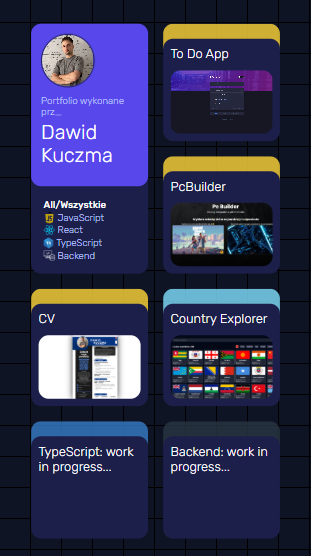
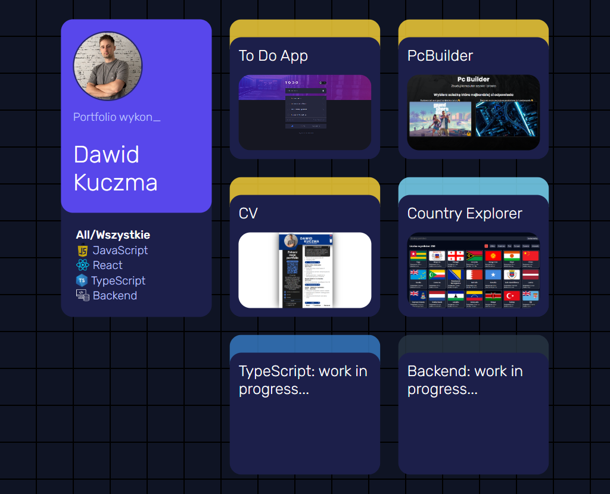
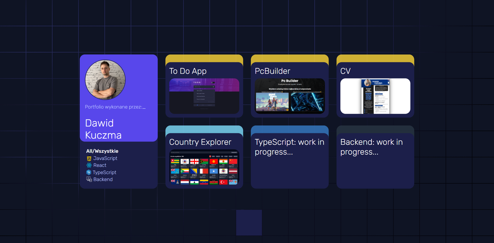

# 🌐 Dawid Kuczma - Portfolio

Moje portfolio frontendowe — aplikacja przedstawia menu, z którego można przejść do moich projektów. Strona została stworzona przy użyciu HTML, SCSS i JavaScript.

## 🔗 Demo

👉 [Zobacz na żywo](https://dawidkuczma-dev.github.io)

## 📸 Zrzuty ekranu

<p align="center">
  
  
  
</p>


## ⚙️ Technologie

- HTML5 (w tym element `<canvas>` do dynamicznego tła)
- SCSS (Sass)
- JavaScript (Vanilla)

## 📁 Struktura folderów

```bash
📁 DawidKuczma-dev.github.io
├── 📁 assets
│   └── 📁 images
│       ├── CountryExplorer-hover.png
│       ├── CountryExplorer.png
│       └── ...
├── 📁 css
│   └── main.css
├── 📁 js
│   ├── background.js
│   ├── filters.js
│   ├── typing.js
│   └── video.js
├── 📁 scss
│   ├── _background.scss
│   ├── _base.scss
│   └── ...
├── index.html
└── README.md

📁 assets/images – zawiera zrzuty ekranu, grafiki projektów i ikony  
📁 js – skrypty odpowiedzialne za animacje, interakcje i efekty  
📁 scss – pliki źródłowe stylów (moduły SCSS)  
📁 css – skompilowany plik stylów dla strony

```

## 📦 Funkcje

- Przejrzysty i intuicyjny układ strony głównej
- Interaktywne menu z płynnymi przejściami do projektów
- Responsywny design dostosowany do mobile, tablet i desktop
- Interaktywne tło z kafelkami, które podświetlają się po najechaniu kursorem
- Dynamiczna fala światła rozrastająca się w przerwach między kafelkami podczas ruchu myszy.
- Dynamiczne filtry pozwalające na sortowanie projektów według kategorii (np. JS, React, All)
- Wykorzystanie SCSS mixins do automatycznego dopasowywania kolorów kafelków na podstawie klas HTML i zmiennych kolorystycznych
- Efekt pisania na maszynie (typewriter effect) z animacją wpisywania i kasowania tekstu w pętli

## 🧠 Czego się nauczyłem

- Organizacja plików i modularność w projekcie frontendowym
- Zaawansowane stylowanie z wykorzystaniem SCSS, w tym mixins i zmienne
- Manipulacja DOM w czystym JavaScript: filtrowanie elementów, animacje, efekty wizualne
- Tworzenie efektów interaktywnych takich jak podświetlane kafelki z falą świetlną reagującą na ruch myszy
- Implementacja efektu pisania na maszynie (typewriter effect) z animacją tekstu
- Publikacja i konfiguracja strony na GitHub Pages

## 🚀 Uruchomienie lokalne

1. Sklonuj repozytorium  
```bash
git clone https://github.com/DawidKuczma-dev/DawidKuczma-dev.github.io
```
2. Otwórz plik `index.html` w przeglądarce lub uruchom lokalny serwer (np. Live Server)

## 📇 Autor

Dawid Kuczma  
[LinkedIn](https://www.linkedin.com/in/dawid-kuczma-a60836369/) • [GitHub](https://github.com/DawidKuczma-dev)

## 📝 Licencja

Ten projekt jest dostępny na zasadach licencji MIT.


